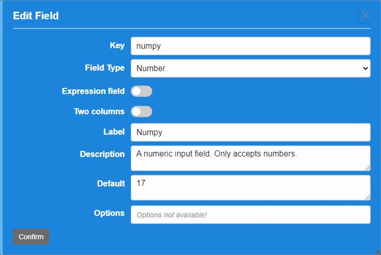
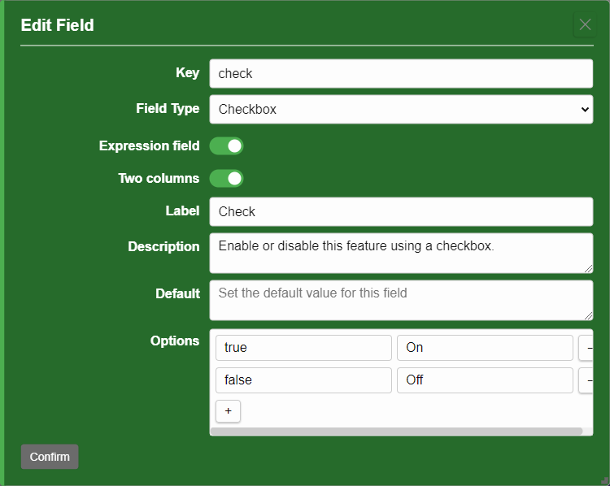

## Field Types

Formidable supports a variety of field types to accommodate different data inputs and layouts. Each field type has its own properties and behaviors.

### 1. Guid Field

A field that generates a unique identifier (GUID). If this field is used on a template, it will make it possible to turn the storage-data into a data-collection.
Data-collections in the future may expose the data-set as a restful API.

### 2. Text Field

A simple text input for single-line text. Use this field when you want to collect short text responses.

### 3. Textarea Field (Multiline Text)

A multi-line text input for longer text entries. Use this field when you want to allow users to enter more extensive text.

### 4. Number Field

A numeric input that only accepts numbers. Use this field when you want to collect numerical data.

### 5. Boolean Field (Checkbox)

A true/false toggle switch. Use this field when you want to present a binary choice.

> **Options**: Add true and false with its consecutive values in options.

### 6. Dropdown Field

A selection input with a list of options. Use this field when you want to present a list of choices and allow the user to select one.

> **Options**: Add a list of options for the user to choose from.

### 7. Date Field

A date picker input for selecting dates. Use this field when you want to allow users to select a date from a calendar interface.

### 8. Range Field (Range Slider)

An input for selecting a value from a range with a slider. Use this field when you want to allow users to select a value within a specified range.

> **Options**: Add a numeric minimum, maximum and step-size value for the range.

### 9. Multioption Field (Multiple Choice)

An input for selecting multiple options from a set. Use this field when you want to present a list of options and allow the user to choose more than one.

> **Options**: Add a list of options for the user to choose from.

### 10. Image Field (Image Upload)

An input for uploading image files. Use this field to allow users to upload images.

### 11. Radio Field (Radio Buttons)

An input for selecting one option from a set. Use this field when you want to present a list of options and allow the user to choose only one.

> **Options**: Add a list of options for the user to choose from.

### 12. List Field

An input for a list of multiple items. Use this field to collect a series of related entries.

> **Options**: Optionally add a list of items for the user to choose from.

### 13. Table Field

An input for tabular data. Use this field to create structured data entries.

> **Options**: Add a list of columns and their labels for the table.

### 14. Link Field

An input for entering a URL link or a special formidable link. Very useful for creating links to other resources or pages.

### 15. Tags Field

An input for entering tags or keywords. Use this field when you want to allow users to add multiple tags to their submission.

---

## Loop Field (LoopStart/LoopStop)

An input for creating a loop structure. Use this field when you want to allow users to create repeating sections in their submission.
Place a loop field on the template and configure its settings. When you do so a LoopStart and LoopStop field will be created automatically.

You can then add fields inside the loop to collect repeated data. Loop fields are useful for scenarios where you need to gather multiple entries of the same type, such as a list of items or a series of related questions. The max nesting level for loop fields is 2 because it allows for a parent loop with a child loops inside. Going any deeper than 2 would result in a complex structure that's almost impossible to manage.

## How to Use Field Types

1. **Add a Field**: Click on **+ Add Field** in the Template editor.
2. **Select Field Type**: Choose the desired field type from the dropdown.
3. **Configure Properties**: Set the field label, description, and any other relevant properties.
4. **Confirm Changes**: Review your changes and click **Confirm** to apply them.
5. **Save Changes**: Click **Save** to apply the changes (added fields) to your form.

---

### Related Topics

- [Templates](#templates)
- [Expressions](#expressions)
