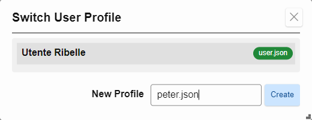
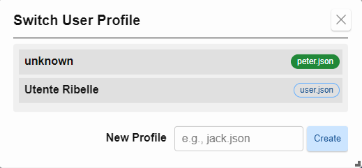

## User Profiles

Formidable allows you to create and switch between multiple **user profiles**, each with its own configuration (`author`, `theme`, `context folder`, etc.). This makes it easy to tailor the environment for different users or use cases.

---

### Creating a Profile

To create a new profile:

1. Select **`Config → Switch Profile...`** from the main menu.
2. Enter a profile name like `jack.json` (include the `.json` extension).
3. Click **Create**.

Once created, it's automatically activated, and you can start configuring by editing the [settings](#settings).

---

### Switching Profiles

To switch between existing profiles:

1. Open the **Switch User Profile** modal by using the menu **`Config → Switch Profile...`**.
2. Click on the profile you want to activate.

Your settings will update immediately to reflect the selected profile.

---

### Editing Profile Settings

After switching, open **[Settings...](#settings)** from the `Config` menu to configure options specific to that profile.

Examples:

- Set author name/email.
- Enable Git, logging, or plugins.
- Choose dark mode or icon buttons.

Changes are stored in the active profile file (e.g. `user.json`, `jack.json`, etc.).

---

### Profile Files

All profiles are stored as `.json` files in the `config/` folder within your app directory.  
You can back them up, share them, or version them with Git.

---

### Related Topics

- [Settings](#settings)
- [Templates](#templates)