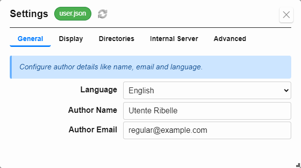
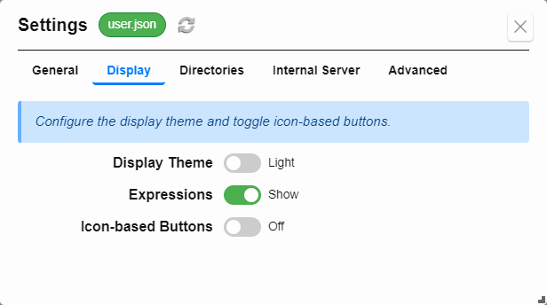
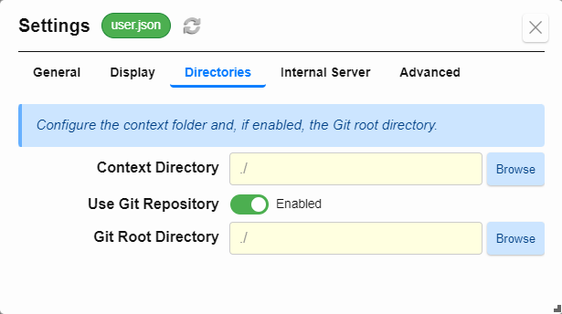
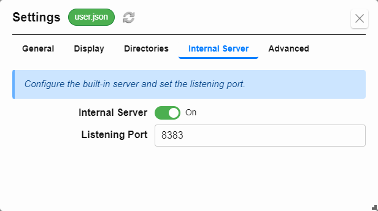
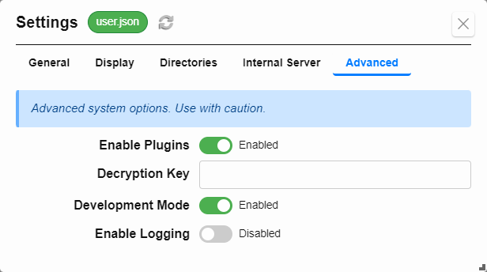

## Configuration Settings

Formidable allows you to customize its behavior and appearance per profile (e.g. `user.json`) using the **Settings** modal. This includes identity settings, visual preferences, storage paths, plugin control, development mode, and server behavior.

To access the settings, open the **`Config → Settings...`** menu option.

---

### General

Set author identity used in forms and outputs.

- **Author Name** – Used in metadata and rendered output.
- **Author Email** – Used in metadata and rendered output.

---

### Display

Customize Formidable’s appearance and UI features.

- **Display Theme** – Toggle between Light and Dark mode.
- **Expressions** – Show or hide inline expression results in sidebars.
- **Icon Buttons** – Use icon-only buttons (experimental).

---

### Directories

Define where your context lives and configure Git usage.

- **Context Folder** – Sets the base folder for your templates and form data.
- **Use Git Repository** – Enables Git tracking and version control features.
- **Git Root Directory** – Path used for Git operations.

> *The context folder is where your templates and filled forms are stored. If you enable Git, Formidable will use the specified Git root directory for version control operations.*
> *When Git is enabled, the **Git Actions...** menu becomes available for staging, committing, and syncing files.*

---

### Internal Server

Configure Formidable’s built-in Markdown preview server.

- **Internal Server** – Toggle the server on or off.
- **Server Port** – Specify the port for preview access (default: `8383`).

> *With the server enabled, preview Markdown in your browser via `http://localhost:8383`.*

---

### Advanced

Access system-level features and development controls.

- **Enable Plugins** – Turn plugin support on or off.
- **Secret Decryption Key** – Enter the key to decrypt encrypted field values.
- **Development Mode** – Enables developer features for debugging or custom extensions.
- **Enable Logging** – Capture detailed runtime logs for diagnostics.

---

### Related Topics

- [User Profiles](#profiles)
- [Templates](#templates)
