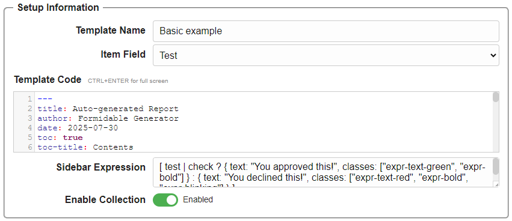

## Formidable Templates

Formidable helps you define **templates** for structured content such as forms, documents, or reports.  
Templates are fully under your control and can be customized to fit different use cases.

---

### Template Setup

To create a new template:

1. **Open the Template Editor**: Navigate to the template editor in Formidable.  
2. **Enter Setup Information**: Give your template a name, select an item field, and edit the template code.  
3. **Enable or Disable Collection**: Use the toggle to decide whether the template can collect multiple items.  
4. **Save Your Template**: Once setup is complete, save your work.

#### Item Field

The item field is a special field (of type text) that will be shown on the sidebar for the form-entries you create based on this template.

#### Template Code

The template code defines the structure and layout of the form entries created from this template. It is mainly handlebars syntax and if you are familiar with HTML, you will find it easy to use.

#### Sidebar Expression

The sidebar expression determines how the item field is displayed in the sidebar. It is a special code syntax that allows you to customize the appearance and behavior of the item field.

See [Expressions](#expressions) for more details.

#### Enable Collection

Use the toggle to decide whether the form input for this template can be made into a collection that can hold multiple form entries. And can later be accessed as a dataset in the internal server as an web-accessible resource.

---

### Adding Fields

Fields define the structure of your template. Each field has a type, label, description, and optional default value.  
You can add as many fields as needed to capture the data for your template.

1. **Add a Field**: Click **+ Add Field** in the Field Information section.  
2. **Edit Properties**: Choose the field type and configure details such as label, description, and defaults.  
3. **Reorder Fields**: Drag fields to rearrange them in the desired order.  
4. **Save Changes**: Confirm your edits to apply them to the template.

---

### Example: Text Field

A basic example is the **Text** field. It provides a single-line text input with customizable properties.

Options include:

- **Key** – the internal field identifier.  
- **Label** – the name shown to users.  
- **Description** – help text describing the field’s purpose.  
- **Default** – a prefilled default value.  
- **Expression Field / Two Columns** – layout and expression options.

---

### Field Types

Formidable supports many different field types such as Boolean, Dropdown, Date, List, Table, Image, and more.  

👉 See [Field Types](#field-types) for a full overview of all supported types.

---

### Looping

Looping allows you to repeat sections dynamically, adapting the template to user input.

How to use looping:

1. **Enable Looping**: Mark the section that should repeat.  
2. **Define Conditions**: Specify when the section should repeat (e.g., based on a field value).  
3. **Customize Content**: Add fields and design the repeatable section.  
4. **Test**: Preview the template to confirm the looping behavior.

---

### Related Topics

- [Field Types](#field-types)
- [Expressions](#expressions)

