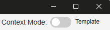

## Welcome to Formidable

### Getting Started

To get started with Formidable, follow these steps:

1. **Installation**: Download and install the latest Formidable installer from [the official website or repository](https://github.com/petervdpas/Formidable/releases).
2. **Create a New Template**: Use the intuitive interface to create a new template by creating fields and arranging them as needed.
3. **Switch Context**: Use the context switcher to change between template creation or storage, allowing you to manage multiple forms easily.
4. **Fill out a Form**: Once your template is ready, you can fill out a form using the fields you created.
5. **Render output**: After filling out the form, you can render the output in various formats such as Markdown and HTML.
6. **Check your work in the Wiki**: With the internal server running, you can check your work by accessing the local server URL in your web browser. This allows you to see how your forms will look and function in a [live environment](http://localhost:8383).

### Context Mode

Formidable allows you to switch **template creation mode** and **storage mode** easily. This means you can move from creating a template to filling out a form or viewing the rendered output without losing your place.

It is a simple toggle switch in the upper right corner of the interface.

Don't forget to check the [Templates documentation](#templates) for more information on creating and managing templates.
