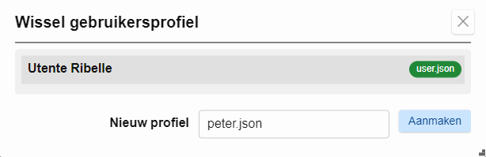
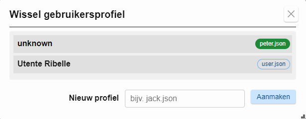
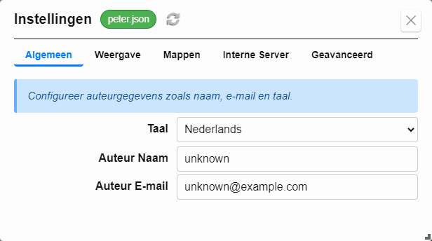

## Gebruikersprofielen

Formidable ondersteunt meerdere **gebruikersprofielen**, elk opgeslagen in een apart `.json` configuratiebestand.  
Profielen maken het mogelijk om de omgeving aan te passen per gebruiker of gebruikssituatie (bijv. auteurgegevens, thema, contextmap).

---

### Profiel aanmaken

1. Open **`Config ⇨ Wissel gebruikersprofiel...`** vanuit het hoofdmenu.  
2. Voer een nieuwe profielnaam in, bijvoorbeeld `jack.json` (gebruik altijd de `.json` extensie).  
3. Klik op **Aanmaken**.

> Zodra het profiel is aangemaakt, wordt het direct actief. Je kunt het daarna configureren via de [Instellingen](#settings).

---

### Profiel wisselen

Om tussen bestaande profielen te wisselen:

1. Open **`Config ⇨ Wissel gebruikersprofiel...`**.  
2. Klik op het profiel dat je wilt activeren.

De applicatie laadt direct opnieuw met de instellingen van dat profiel.

> 💡 De profiel­lijst toont de ingestelde **Auteur Naam**. Als deze niet is ingesteld, verschijnt standaard `unknown`.

---

### Profielinstellingen bewerken

Na het wisselen kun je via **`Config ⇨ Instellingen...`** de details van het actieve profiel aanpassen.

De bestandsnaam van het actieve profiel (bijv. `peter.json`) wordt altijd bovenin het instellingenvenster getoond:

Mogelijke instellingen zijn o.a.:

- Auteur naam en e-mail  
- Taalvoorkeur  
- Donkere modus, iconen of weergaveopties  
- Git, logging of plugininstellingen  

Alle wijzigingen worden opgeslagen in het actieve profielbestand.

---

### Profielbestanden

- Profielen worden opgeslagen als `.json` bestanden in de `config/` map van je applicatie.  
- Je kunt ze back-uppen, delen of beheren met Git.  
- Voorbeelden: `user.json`, `jack.json`, `peter.json`.

---

### Gerelateerde onderwerpen

- [Instellingen](#settings)  
- [Templates](#templates)
