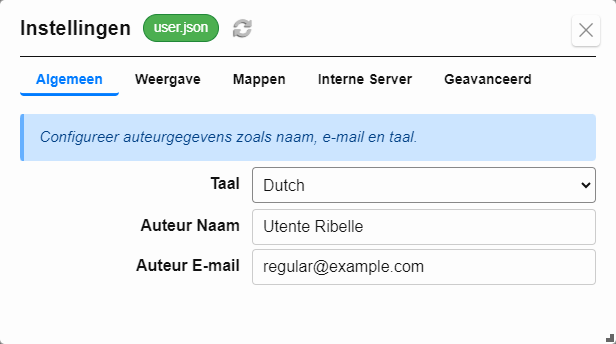
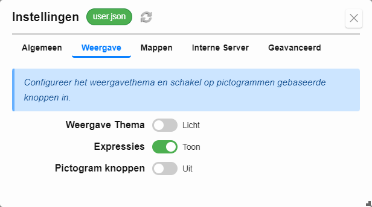
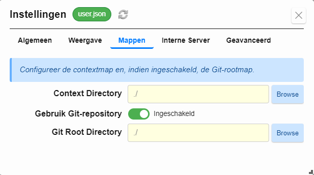
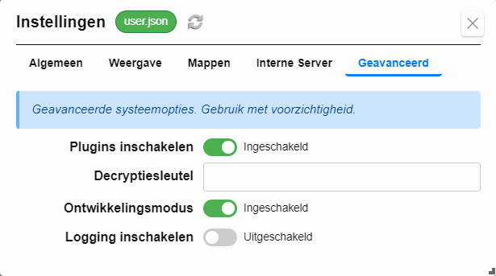

## Configuratie-instellingen

Formidable laat je het gedrag en de weergave aanpassen per profiel (bijv. `user.json`) via het **Instellingen**-venster. Dit omvat identiteitsinstellingen, visuele voorkeuren, opslagpaden, pluginbeheer, ontwikkelmodus en servergedrag.

Om de instellingen te openen, kies **`Config ⇨ Instellingen...`** in het menu.

---

### Algemeen

Stel auteurgegevens in die gebruikt worden in formulieren en uitvoer.

- **Taal** – Bepaalt de taal van de interface.
- **Auteur Naam** – Gebruikt in metadata en weergegeven uitvoer.
- **Auteur E-mail** – Gebruikt in metadata en weergegeven uitvoer.

---

### Weergave

Pas de weergave en UI-functies van Formidable aan.

- **Weergave Thema** – Schakel tussen Licht- en Donkermodus.
- **Expressies** – Toon of verberg inline resultaat-expressies in zijbalken.
- **Pictogram knoppen** – Gebruik knoppen die alleen uit pictogrammen bestaan (experimenteel).

---

### Mappen

Bepaal waar je context staat en configureer Git-gebruik.

- **Context Directory** – Stelt de basismap in voor je templates en formulieren.
- **Gebruik Git-repository** – Schakelt Git-tracking en versiebeheer in.
- **Git Root Directory** – Pad dat wordt gebruikt voor Git-operaties.

> *De contextmap is waar je templates en ingevulde formulieren worden opgeslagen. Wanneer Git is ingeschakeld, gebruikt Formidable de opgegeven Git-rootmap voor versiebeheer.*  
> *Met Git ingeschakeld wordt het menu **Git-acties...** beschikbaar voor het toevoegen, committen en synchroniseren van bestanden.*

---

### Interne Server

Configureer de ingebouwde Markdown-previewserver.

- **Interne Server** – Schakel de server in of uit.
- **Luisterpoort** – Stel de poort in voor preview-toegang (standaard: `8383`).

> *Wanneer de server actief is, kun je Markdown-voorbeelden in je browser bekijken via `http://localhost:8383`.*

---

### Geavanceerd

Toegang tot systeemopties en ontwikkelfuncties.

- **Plugins inschakelen** – Schakel ondersteuning voor plugins in of uit.
- **Decryptiesleutel** – Voer de sleutel in om versleutelde velden te ontsleutelen.
- **Ontwikkelingsmodus** – Activeert ontwikkelfuncties voor debuggen of uitbreidingen.
- **Logging inschakelen** – Leg gedetailleerde runtime-logs vast voor diagnose.

---

### Gerelateerde onderwerpen

- [Gebruikersprofielen](#profiles)
- [Templates](#templates)
