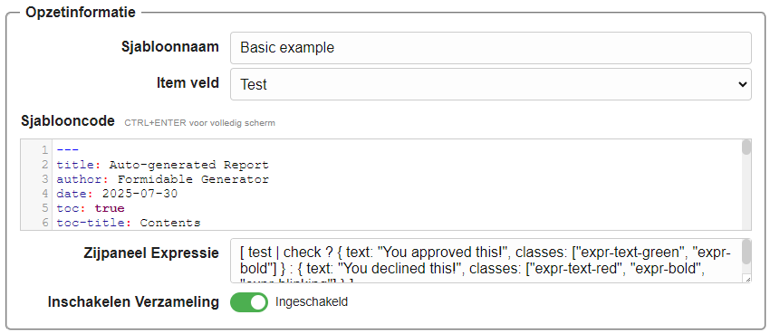
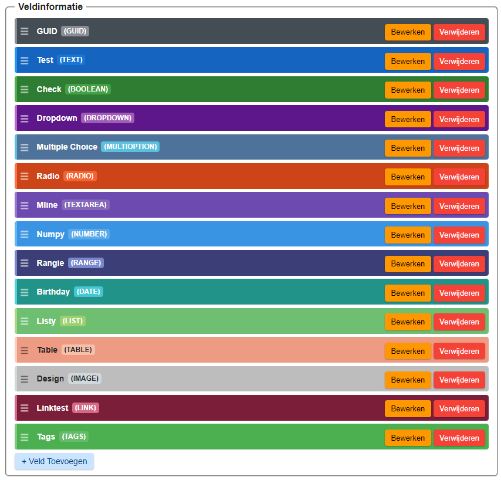
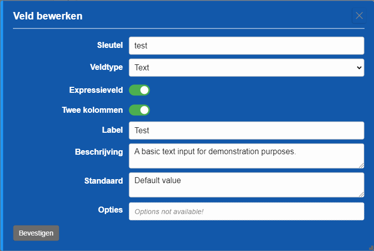

## Formidable Sjablonen

Formidable helpt je bij het definiëren van **sjablonen** voor gestructureerde inhoud zoals formulieren, documenten of rapporten.  
Sjablonen zijn volledig onder jouw controle en kunnen worden aangepast aan verschillende gebruikssituaties.

---

### Sjabloon Opzet

Een nieuw sjabloon aanmaken:

1. **Open de Sjabloon Editor**: Navigeer naar de sjabloon-editor in Formidable.  
2. **Vul de Opzetinformatie in**: Geef je sjabloon een naam, kies een itemveld en bewerk de sjablooncode.  
3. **Verzameling in- of uitschakelen**: Gebruik de schakelaar om te bepalen of het sjabloon meerdere items kan verzamelen.  
4. **Sla je Sjabloon op**: Wanneer de opzet compleet is, sla je het sjabloon op.

#### Itemveld

Het itemveld is een speciaal veld (meestal van type tekst) dat in de zijbalk wordt weergegeven voor de formulier­items die je met dit sjabloon aanmaakt.

#### Sjablooncode

De sjablooncode bepaalt de structuur en lay-out van de formulier­items die uit dit sjabloon worden gemaakt.  
Het gebruikt voornamelijk Handlebars-syntax en als je bekend bent met HTML, vind je het eenvoudig te gebruiken.

#### Zijpaneel Expressie

De zijpaneel expressie bepaalt hoe het itemveld in de zijbalk wordt weergegeven.  
Dit is een speciale code-syntax waarmee je de weergave en het gedrag kunt aanpassen.

Zie [Expressies](#expressies) voor meer informatie.

#### Verzameling Inschakelen

Gebruik de schakelaar om te bepalen of invoer voor dit template een **verzameling** kan vormen met meerdere formulier­items.  
Verzamelingen kunnen later worden benaderd als datasets in de interne server, als web-toegankelijke bron.

---

### Velden Toevoegen

Velden bepalen de structuur van je sjabloon. Elk veld heeft een type, label, beschrijving en optionele standaardwaarde.  
Je kunt zoveel velden toevoegen als nodig is om de gegevens voor je sjabloon vast te leggen.

1. **Voeg een veld toe**: Klik op **+ Veld Toevoegen** in de veldinformatie-sectie.  
2. **Bewerk eigenschappen**: Kies het veldtype en configureer details zoals label, beschrijving en standaardwaarden.  
3. **Herorden velden**: Sleep velden om ze in de gewenste volgorde te zetten.  
4. **Sla wijzigingen op**: Bevestig je bewerkingen om ze toe te passen op het sjabloon.

---

### Voorbeeld: Tekstveld

Een basisvoorbeeld is het **Tekst**-veld. Dit biedt een invoer voor één regel tekst met aanpasbare eigenschappen.

Opties zijn o.a.:

- **Sleutel** – de interne veldidentificatie.  
- **Label** – de naam die aan gebruikers wordt getoond.  
- **Beschrijving** – helptekst die het doel van het veld uitlegt.  
- **Standaard** – een vooraf ingevulde standaardwaarde.  
- **Expressieveld / Twee kolommen** – layout- en expressie-opties.

---

### Veldtypes

Formidable ondersteunt veel verschillende veldtypes zoals Boolean, Dropdown, Datum, Lijst, Tabel, Afbeelding en meer.  

👉 Zie [Veldtypes](#field-types) voor een volledig overzicht van alle ondersteunde types.

---

### Herhaling (Looping)

Herhaling maakt het mogelijk om secties dynamisch te laten terugkomen, afhankelijk van de ingevoerde gegevens.  

Zo gebruik je herhaling:

1. **Schakel herhaling in**: Markeer de sectie die moet worden herhaald.  
2. **Definieer voorwaarden**: Geef aan wanneer de sectie moet herhalen (bijv. gebaseerd op een veldwaarde).  
3. **Ontwerp de inhoud**: Voeg velden toe en ontwerp de herhaalbare sectie.  
4. **Test**: Bekijk een voorbeeld om te bevestigen dat het gedrag werkt zoals verwacht.

---

### Gerelateerde onderwerpen

- [Veldtypes](#field-types)  
- [Expressies](#expressies)