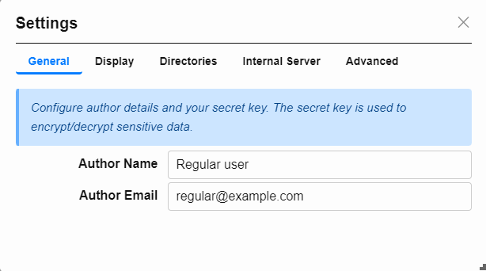
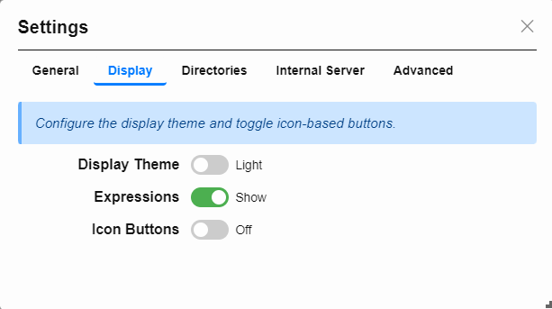
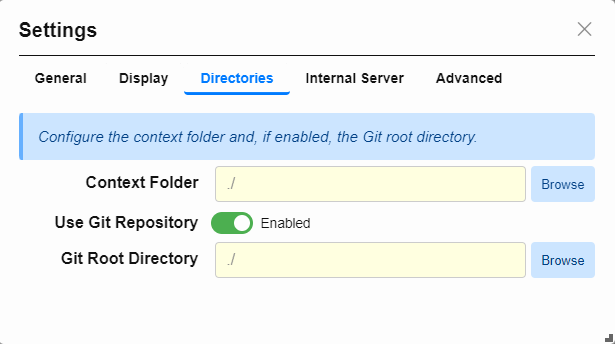
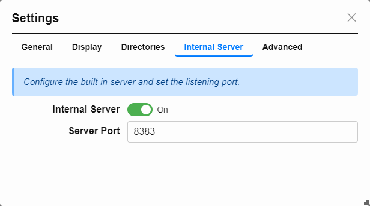

## Configuration Settings

Formidable allows you to customize its behavior and appearance for a certain profile (user.json by default) through the **Settings** modal. This includes global options such as theme, author identity, directory paths, plugin support, and server configuration.

To access it, choose **`Config → Settings...`** from the main menu.

---

### General

Configure author identity, enable plugin functionality, and control logging behavior.

- **Author Name / Email**: Used in metadata and rendered output.
- **Enable Plugins**: Turns plugin functionality on or off.
- **Enable Logging**: Controls runtime logging behavior.

---

### Display

Configure how Formidable looks and feels.

- **Display Theme**: Toggle between Light and Dark mode.
- **Icon Buttons**: Enable or disable icon-based controls (experimental).

---

### Directories

Define the base folder for context (templates, storage) and optionally enable Git.

- **Context Folder**: Sets the root folder for working templates and data.
- **Use Git Repository**: Enables Git integration.
- **Git Root Directory**: Select the folder where Git operations will take place.

_Notes: The context folder is where your templates and filled forms are stored. Ensure it is set to a location that suits your workflow.
If you enable Git, Formidable will activate the **Git Actions...** menu, allowing you to perform Git operations directly from the application._

---

### Internal Server

Enable and configure Formidable's built-in preview server.

- **Internal Server**: Enable/disable the built-in server.
- **Server Port**: Port number the server listens on (default: `8383`).

You can preview Markdown output in your browser at [http://localhost:8383](http://localhost:8383) when the server is active.

### Related Topics

- [User Profiles](#profiles)
- [Templates](#templates)