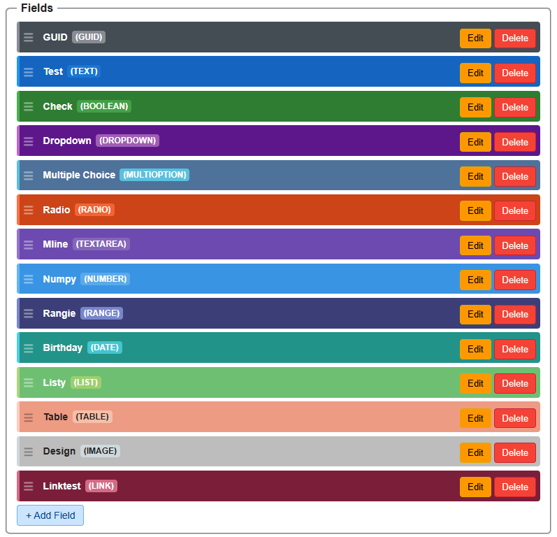

## Formidable Templates

Formidable provides a way to help you quickly create templates for different purposes. Templates can be easily customized, allowing you to adapt them to your specific needs. And are fully under your control. You can create templates for forms, documents, or any other structured content you need.

### Creating a Template

To create a new template in Formidable, follow these steps:

1. **Open the Template Editor**: Navigate to the template editor in Formidable.
2. **Add Fields**: Use the field editor to add various fields to your template.
3. **Customize Fields**: Configure each field's properties, such as type, validation rules, and default values.
4. **Save the Template**: Once you have added and configured all the fields, save your template.

### Available Fieldtypes

Formidable supports a wide range of field types that you can use in your forms. Here are some of the key field types available:

- **Text Fields**: For single-line text input.
- **Textarea**: For multi-line text input.
- **Checkboxes**: For selecting multiple options.
- **Radio Buttons**: For selecting a single option from a list.
- **Dropdowns**: For selecting an option from a dropdown list.
- **Date Pickers**: For selecting dates.
- **File Uploads**: For allowing users to upload files.
- **Number Fields**: For numeric input.

### Looping

Looping allows you to create dynamic forms that can adapt to user input. You can use looping to repeat sections of your form based on user responses, making it easy to collect information in a structured way.

#### How to Use Looping

1. **Enable Looping**: In the form editor, enable the looping feature for the desired section.
2. **Define Loop Conditions**: Specify the conditions under which the loop should repeat (e.g., based on user input or a specific field value).
3. **Customize Loop Content**: Design the content that will be repeated within the loop, including any fields or elements.
4. **Test Your Form**: Preview your form to ensure the looping behavior works as expected.

For more information on using looping in Formidable, refer to the documentation.
